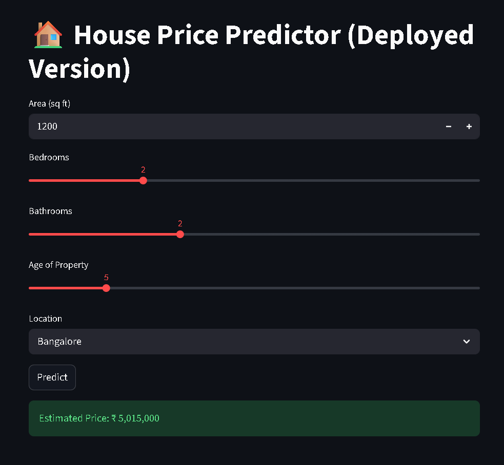
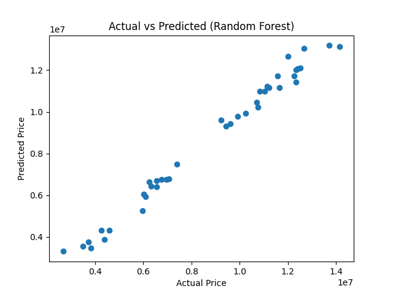
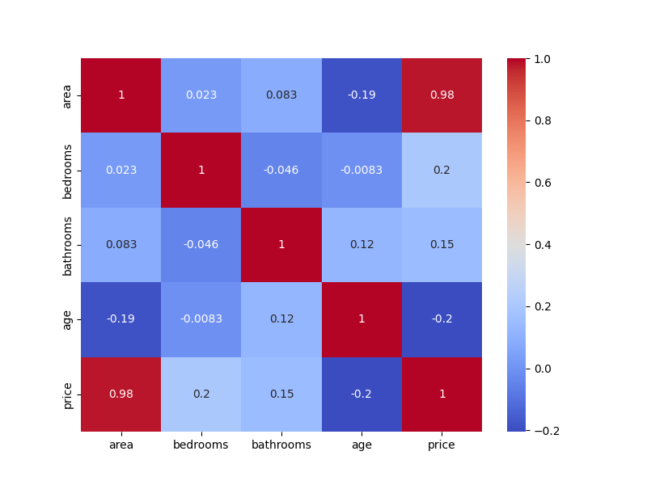
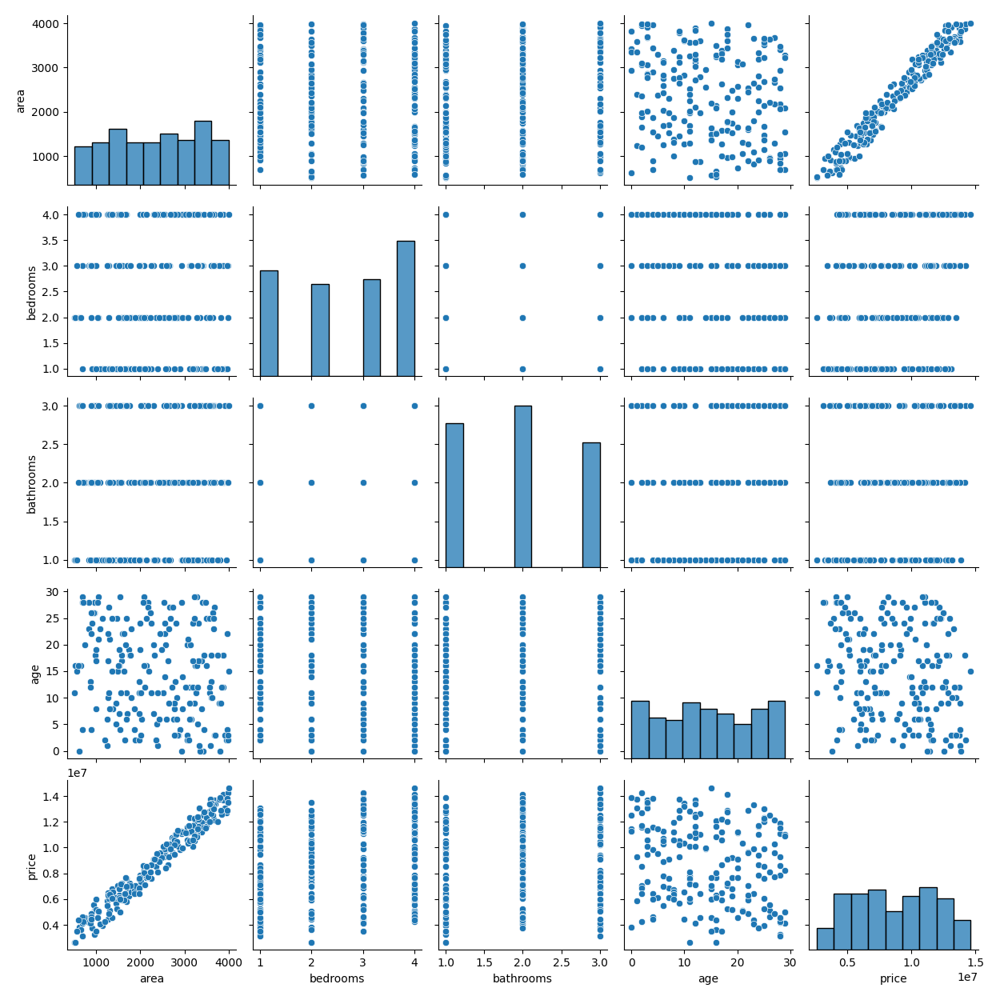

# 🏠 House Price Predictor

## 🚀 Live Demo

👉 https://house-price-prediction-ml-api-24crbhankqmzwpvsp7ukgm.streamlit.app/

## 📂 GitHub Repository

👉 https://github.com/Vayu-143/house-price-prediction-ml-api

---

## 📌 Project Overview

This is an end-to-end Machine Learning project that predicts house prices based on user inputs like area, number of bedrooms, bathrooms, property age, and location.

The project demonstrates full ML workflow including:

* Data preprocessing
* Model training
* Prediction system
* Web UI using Streamlit
* Deployment on cloud

---

## 🧠 Architecture

**Streamlit UI → ML Pipeline (Scikit-learn)**

*(Flask API also implemented for backend understanding but not used in deployment)*

---

## ⚙️ Tech Stack

* Python
* Pandas, NumPy
* Scikit-learn
* Streamlit
* Flask (for API)
* Joblib

---

## 🔧 Features

* Real-time house price prediction
* Clean and interactive UI
* End-to-end ML pipeline
* Deployment-ready project structure
* Beginner-friendly code

---

## 📊 Input Example

```json
{
  "area": 2000,
  "bedrooms": 3,
  "bathrooms": 2,
  "age": 5,
  "location": "Bangalore"
}
```

## 📈 Output Example

```json
{
  "predicted_price": 6840000
}
```

---

## ▶️ How to Run Locally

### 1. Clone Repository

```bash
git clone https://github.com/Vayu-143/house-price-prediction-ml-api.git
cd house-price-prediction-ml-api
```

### 2. Install Dependencies

```bash
pip install -r requirements.txt
```

### 3. Train Model

```bash
python -m src.train_model
```

### 4. Run App

```bash
streamlit run app.py
```

---

## 📸 Screenshots

### 🔹 App UI


### 🔹 Prediction Result



### 🔹 Prediction Example



### 🔹 Heatmap



### 🔹 Pairplot



---

## 📂 Project Structure

```
House-Price-Predictor/
│
├── api/                  # Flask API
├── data/                 # Dataset
├── images/               # Screenshots
├── models/               # Trained models (.pkl)
├── src/                  # ML pipeline code
├── app.py                # Streamlit UI
├── requirements.txt
├── README.md
└── .gitignore
```

---

## 👨‍💻 Author

**Vayunandan Mishra**

---

## 🎯 Key Learnings

* Built complete ML pipeline
* Learned deployment using Streamlit Cloud
* Integrated frontend with ML model
* Created API using Flask
* Debugged real-world errors

---

## 📌 Future Improvements

* Use real-world dataset (Kaggle)
* Add more features & feature engineering
* Improve model accuracy (XGBoost, tuning)
* Deploy API + UI separately
* Add authentication

---

## ⭐ If you like this project

Give it a star ⭐ on GitHub!
